# BackgroundWorker Architecture: Production vs Tests

## Overview

This document explains why the `BackgroundWorker` architecture works correctly in production but breaks in parallel tests. The root cause is a **shared global PostgreSQL queue** being accessed by **multiple workers** with **different Qdrant collections**.

---

## 1. Production Flow (Works Correctly) 🚀

In production, **ONE** `BackgroundWorker` processes all jobs from the shared queue, storing results in **ONE** Qdrant collection. This architecture is thread-safe and scalable.


### Why Production Works

- **Single Worker Instance**: `bootstrap.rs` spawns exactly ONE `BackgroundWorker` at startup
- **Single Collection**: All chunks go to the same Qdrant collection (`config.vector_storage.collection_name`)
- **Thread-Safe**: HTTP server is multithreaded, but worker is single-threaded (processes files sequentially)
- **Global Queue**: PostgreSQL FIFO queue provides fair scheduling across all jobs

---

## 2. Current Test Flow (Broken) 💥

Tests spawn **MULTIPLE** workers (one per test), each tied to a **DIFFERENT** Qdrant collection, but all sharing the **SAME** PostgreSQL queue. This causes race conditions where workers process each other's jobs.


### Why Tests Break

1. **Multiple Workers**: Each test spawns its own `BackgroundWorker` via `spawn_test_worker()`
2. **Shared Queue**: All workers poll the **SAME** PostgreSQL queue (global, persistent)
3. **Different Collections**: Worker A expects "test_A", Worker B expects "test_B"
4. **Race Condition**: Worker A can dequeue File B (meant for Worker B)
5. **Wrong Storage**: Worker A tries to store File B's chunks to "test_A" collection
6. **Cleanup Chaos**: Tests drop collections while workers are still processing

### Actual Error Scenarios

#### Scenario 1: Collection Not Found
```
Worker A dequeues File B
Worker A processes File B
Worker A tries to store to "test_A"
Test B drops collection "test_B"
Worker A crashes: Collection "test_A" not found (if Test A already cleaned up)
```

#### Scenario 2: Wrong Test Assertions
```
Worker A processes File B (meant for Test B)
Worker A stores to "test_A" collection
Test A searches "test_A" → finds File B's chunks ❌
Test A expects File A's chunks → assertion fails
```

#### Scenario 3: Data Corruption
```
Worker A and Worker B process files in random order
Both tests get partial results from wrong files
Unpredictable failures, flaky tests
```

---

## 3. Correct Test Architecture (Solutions) 🔧

### Option 1: Per-Test Queue Isolation (Recommended) ⭐

**Concept**: Give each test its own PostgreSQL queue using namespacing (e.g., table per test or queue_id column).


**Implementation**:
- Add `queue_id` column to `file_queue` table
- `FileRepository::dequeue_file(queue_id)` filters by queue
- `BackgroundWorker::new(queue_id, collection_name)`
- Each test gets unique queue_id (e.g., UUID or test name)

**Pros**:
- ✅ Full test isolation
- ✅ Parallel tests work
- ✅ Matches production architecture
- ✅ Clean, maintainable

**Cons**:
- Requires schema change (add `queue_id` column)
- More complex setup

---

### Option 2: Synchronous Processing (Simple)

**Concept**: Don't spawn workers in tests. Process files synchronously using the `Indexer` API directly.

```mermaid
sequenceDiagram
    autonumber

    participant Test as Test
    participant Indexer as Indexer
    participant Parser as CodeParser
    participant Embedder as EmbeddingService
    participant Qdrant as Qdrant<br/>"test_collection"

    Note over Test,Qdrant: ✅ Solution: No worker, direct processing

    Test->>Qdrant: Create collection
    Test->>Indexer: index_file_content(file, content)

    Indexer->>Parser: Parse file
    Parser-->>Indexer: Chunks

    Indexer->>Embedder: Generate embeddings
    Embedder-->>Indexer: Embeddings

    Indexer->>Qdrant: Store chunks
    Qdrant-->>Indexer: Chunk IDs

    Indexer-->>Test: Success

    Test->>Qdrant: Search/verify
    Test->>Qdrant: Drop collection

    Note over Test: ✅ No workers, no queues,<br/>no race conditions
```



**Implementation**:
- Keep existing `Indexer::index_file_content()` (synchronous)
- Tests call it directly (no queue, no worker)
- Only production uses `BackgroundWorker`

**Pros**:
- ✅ Simplest solution
- ✅ No schema changes
- ✅ Already implemented in some tests

**Cons**:
- ❌ Tests don't exercise full production path (queue + worker)
- ❌ Can't test async job status tracking

---

### Option 3: Serial Test Execution

**Concept**: Run tests serially (one at a time) to avoid race conditions.

```bash
# Force serial execution
cargo test -- --test-threads=1
```

**Pros**:
- ✅ No code changes
- ✅ Tests work

**Cons**:
- ❌ Slow (tests run sequentially)
- ❌ Doesn't scale
- ❌ Defeats purpose of parallel tests

---

### Option 4: Mock Queue Per Test

**Concept**: Replace `FileRepository` with in-memory mock queue for tests.


**Pros**:
- ✅ Fast (in-memory)
- ✅ Test isolation
- ✅ No schema changes

**Cons**:
- ❌ Tests don't use real PostgreSQL queue
- ❌ More mock infrastructure

---

## Comparison Table

| Solution | Test Isolation | Matches Production | Complexity | Performance |
|----------|---------------|-------------------|-----------|-------------|
| **Per-Test Queue** | ✅ Full | ✅ Yes | Medium | Fast |
| **Synchronous** | ✅ Full | ⚠️ Partial | Low | Fastest |
| **Serial Tests** | ✅ Full | ✅ Yes | None | Slow |
| **Mock Queue** | ✅ Full | ⚠️ No (mock) | Medium | Fastest |

---

## Recommendation 🎯

**Use Option 1 (Per-Test Queue Isolation)** for integration tests that need to test the full async pipeline:

1. Add `queue_id` column to `file_queue` table
2. Update `FileRepository::dequeue_file()` to filter by queue
3. Tests create unique queue per `TestAppState`
4. Workers only process their test's queue

**Use Option 2 (Synchronous)** for unit/integration tests that just need to verify indexing logic:

- Call `Indexer::index_file_content()` directly
- Skip queue + worker complexity
- Faster, simpler tests

---

## Current Implementation Status

As of the latest commit:

- ✅ Production: Single worker, single collection (works)
- ❌ Tests: Multiple workers, shared queue, different collections (broken)
- ⚠️ `spawn_test_worker()` exists but causes race conditions
- ✅ Some tests use synchronous `index_file_content()` (works)

---

## Action Items

1. **Audit all tests** using `spawn_test_worker()` → document which fail in parallel
2. **Implement Option 1** (Per-Test Queue) for full integration tests
3. **Refactor tests** to use synchronous indexing where async pipeline isn't needed
4. **Add documentation** to `spawn_test_worker()` warning about shared queue
5. **Consider** making `BackgroundWorker` take `queue_id` in constructor

---

## References

- Production bootstrap: `/crates/codetriever-api/src/bootstrap.rs`
- Test utilities: `/crates/codetriever-api/tests/test_utils.rs`
- Worker implementation: `/crates/codetriever-indexing/src/worker.rs`
- Issue tracking: GitHub Issue #16 (context endpoint work revealed race condition)
