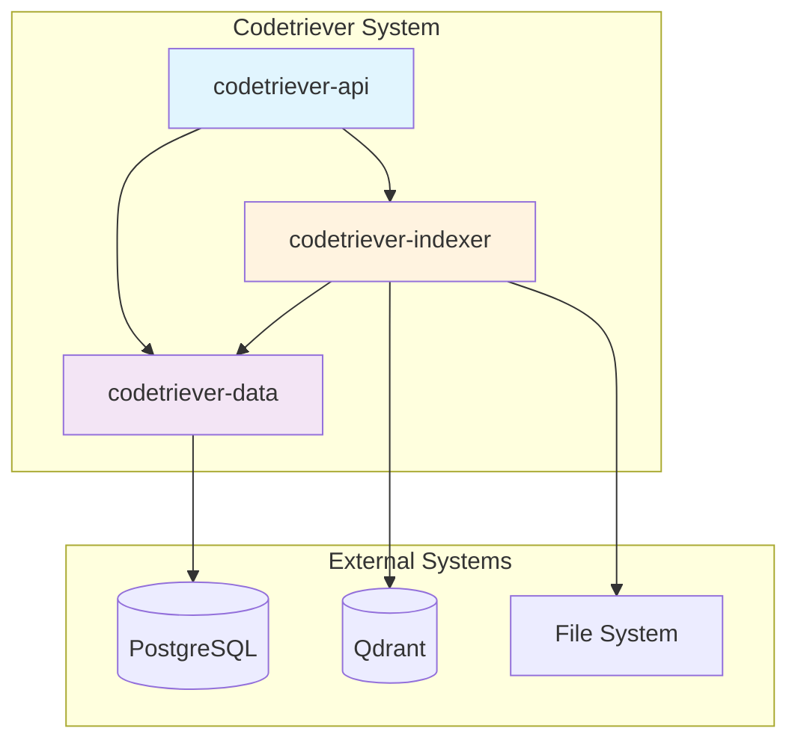
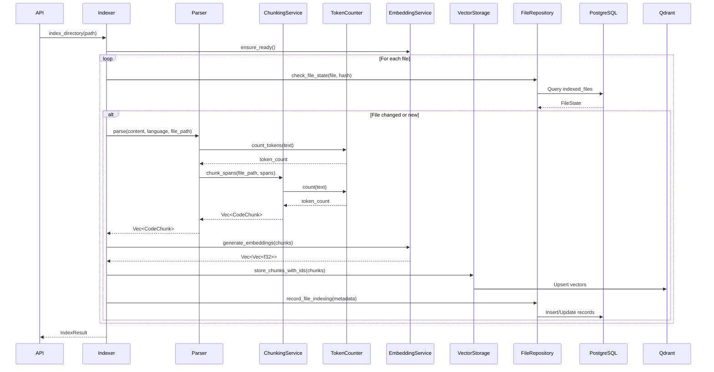
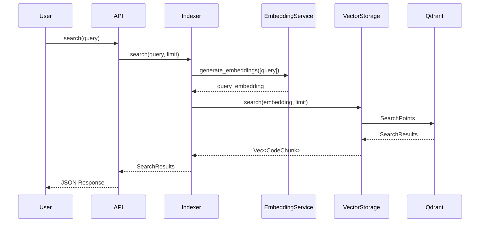
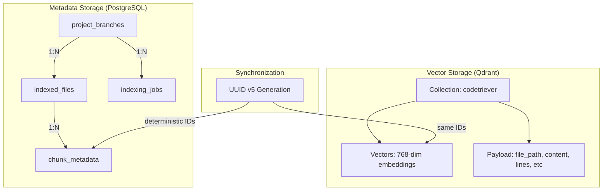
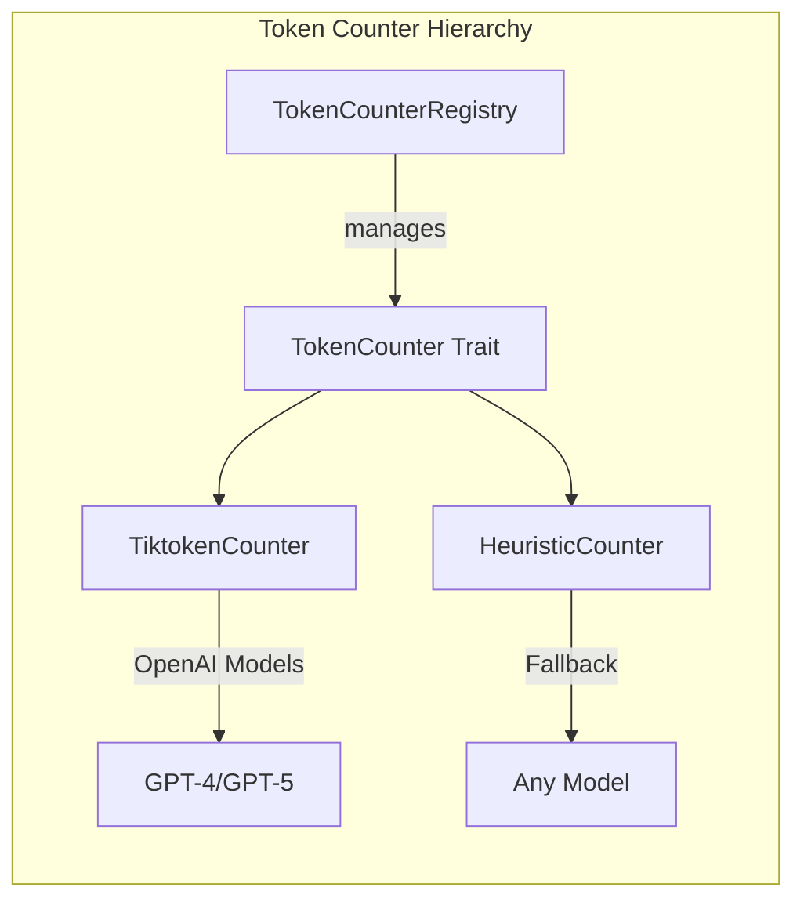
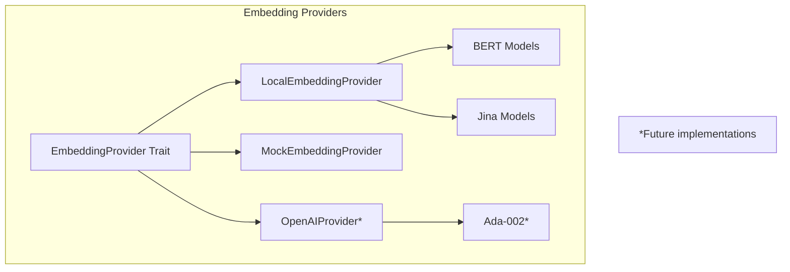
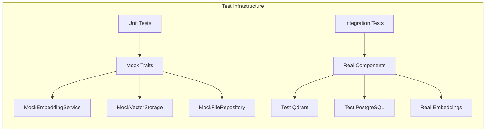

# Codetriever Architecture Documentation

## System Overview

Codetriever is a code search and retrieval system that indexes codebases using semantic embeddings, enabling intelligent code discovery through vector similarity search.

## High-Level Architecture



## Component Architecture

```mermaid
classDiagram
    class Indexer {
        -embedding_service: Box~dyn EmbeddingService~
        -storage: Option~Box~dyn VectorStorage~~
        -code_parser: CodeParser
        -config: Config
        -repository: Option~Arc~dyn FileRepository~~
        +new() Self
        +with_config(config) Self
        +index_directory(path, recursive) IndexResult
        +index_files(files) IndexResult
        +search(query, limit) Vec~SearchResult~
    }
    
    class ContentParser {
        <<trait>>
        +name() str
        +parse(content, language, file_path) Vec~CodeChunk~
        +supports_language(language) bool
        +supported_languages() Vec~str~
    }
    
    class CodeParser {
        -tokenizer: Option~Arc~Tokenizer~~
        -split_large_semantic_units: bool
        -max_tokens: usize
        -overlap_tokens: usize
        +new(tokenizer, split, max, overlap) Self
        +parse(content, language, file_path) Vec~CodeChunk~
        +count_tokens(text) Option~usize~
    }
    
    class ChunkingService {
        -counter: Arc~dyn TokenCounter~
        -budget: TokenBudget
        +new(counter, budget) Self
        +chunk_spans(file_path, spans) Vec~CodeChunk~
        +merge_small_spans(spans) Vec~CodeSpan~
        +split_large_span(span) Vec~CodeSpan~
    }
    
    class TokenCounter {
        <<trait>>
        +name() str
        +max_tokens() usize
        +count(text) usize
    }
    
    class TiktokenCounter {
        -model_name: String
        -encoder: CoreBPE
        -max_tokens: usize
        +new(model_name) Self
    }
    
    class HeuristicCounter {
        -name: String
        -max_tokens: usize
        -chars_per_token: f64
        -calibration_data: Option~CalibrationCache~
        +new(name, max_tokens) Self
        +calibrate(sample_data) Self
    }
    
    class TokenCounterRegistry {
        -counters: HashMap~String, BoxedCounter~
        +new() Self
        +register(name, counter)
        +get(name) Option~Arc~dyn TokenCounter~~
        +get_or_create(name) Arc~dyn TokenCounter~
    }
    
    class EmbeddingService {
        <<trait>>
        +generate_embeddings(texts) Vec~Vec~f32~~
        +provider() dyn EmbeddingProvider
        +get_stats() EmbeddingStats
    }
    
    class DefaultEmbeddingService {
        -provider: Box~dyn EmbeddingProvider~
        -stats: Arc~RwLock~EmbeddingStats~~
        -batch_size: usize
        +new(model) Self
        +process_in_batches(texts) Vec~Vec~f32~~
    }
    
    class EmbeddingProvider {
        <<trait>>
        +embed_batch(texts) Vec~Vec~f32~~
        +embed(text) Vec~f32~
        +embedding_dimension() usize
        +max_tokens() usize
        +model_name() str
        +is_ready() bool
        +ensure_ready()
    }
    
    class VectorStorage {
        <<trait>>
        +store_chunks(chunks) usize
        +store_chunks_with_ids(repo, branch, chunks, gen) Vec~Uuid~
        +search(query, limit) Vec~CodeChunk~
        +delete_chunks(ids)
        +collection_exists() bool
        +ensure_collection()
        +drop_collection() bool
        +get_stats() StorageStats
    }
    
    class QdrantStorage {
        -client: Qdrant
        -collection_name: String
        -dimension: usize
        +new(url, collection, dimension) Self
        +create_collection_if_needed()
    }
    
    class MockVectorStorage {
        -chunks: Arc~Mutex~Vec~CodeChunk~~~
        -collection_exists: Arc~Mutex~bool~~
        +new() Self
    }
    
    class FileRepository {
        <<trait>>
        +ensure_project_branch(ctx) ProjectBranch
        +check_file_state(repo, branch, path, hash) FileState
        +record_file_indexing(repo, branch, metadata) IndexedFile
        +insert_chunks(repo, branch, chunks)
        +replace_file_chunks(repo, branch, path, gen) Vec~Uuid~
        +create_indexing_job(repo, branch, sha) IndexingJob
        +update_job_progress(job_id, files, chunks)
        +complete_job(job_id, status, error)
    }
    
    class DbFileRepository {
        -pool: PgPool
        +new(pool) Self
    }
    
    class MockFileRepository {
        -files: Arc~Mutex~HashMap~~
        -chunks: Arc~Mutex~HashMap~~
        +new() Self
    }
    
    %% Relationships
    Indexer --> ContentParser : uses
    Indexer --> EmbeddingService : uses
    Indexer --> VectorStorage : uses
    Indexer --> FileRepository : uses
    
    ContentParser <|.. CodeParser : implements
    
    CodeParser --> TokenCounter : uses for counting
    
    ChunkingService --> TokenCounter : uses
    
    TokenCounter <|.. TiktokenCounter : implements
    TokenCounter <|.. HeuristicCounter : implements
    
    TokenCounterRegistry --> TokenCounter : manages
    
    EmbeddingService <|.. DefaultEmbeddingService : implements
    DefaultEmbeddingService --> EmbeddingProvider : delegates to
    
    VectorStorage <|.. QdrantStorage : implements
    VectorStorage <|.. MockVectorStorage : implements
    
    FileRepository <|.. DbFileRepository : implements
    FileRepository <|.. MockFileRepository : implements
```



## Data Flow

### Indexing Pipeline



### Search Flow



## Storage Architecture

### Dual Storage System



## Key Abstractions

### Token Counting System



### Embedding Provider System



## Configuration

```yaml
# Environment Variables
DATABASE_URL: PostgreSQL connection string
QDRANT_URL: Qdrant server URL
EMBEDDING_MODEL: Model name (e.g., jinaai/jina-embeddings-v2-small-en)
MAX_EMBEDDING_TOKENS: Maximum tokens per chunk (default: 512)
SPLIT_LARGE_SEMANTIC_UNITS: Whether to split large functions/classes
CHUNK_OVERLAP_TOKENS: Token overlap between chunks
```

## Testing Strategy



## Design Principles

1. **Dependency Inversion**: All major components depend on trait abstractions
2. **Single Responsibility**: Each service has one clear purpose
3. **Open/Closed**: Easy to add new providers without modifying existing code
4. **Interface Segregation**: Traits are minimal and focused
5. **Testability**: All components can be tested in isolation using mocks

## Key Features

- **Language Support**: 25+ programming languages via Tree-sitter
- **Smart Chunking**: Token-aware splitting with overlap for context preservation
- **Multiple Token Counters**: Tiktoken for OpenAI models, heuristic fallback for others
- **Flexible Storage**: Trait-based storage supports Qdrant, mock, and future backends
- **State Tracking**: PostgreSQL tracks file versions and indexing history
- **Incremental Indexing**: Only re-indexes changed files
- **Semantic Search**: Vector similarity search using embeddings

## Performance Characteristics

- **Embedding Batch Size**: 32 texts per batch
- **Default Max Tokens**: 512 per chunk
- **Overlap Tokens**: 128 for context preservation
- **Vector Dimension**: 768 (Jina v2) or model-specific
- **Supported File Size**: No hard limit (large files are automatically chunked)