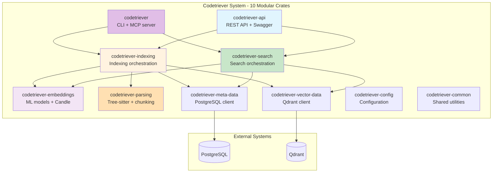
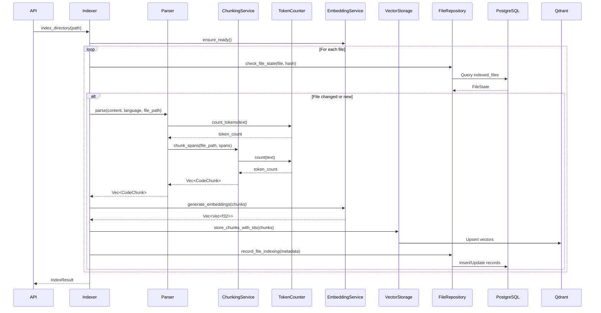
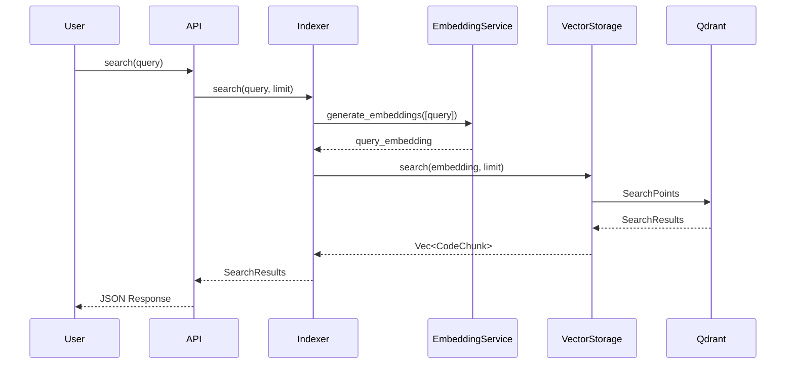
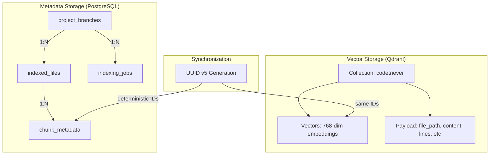
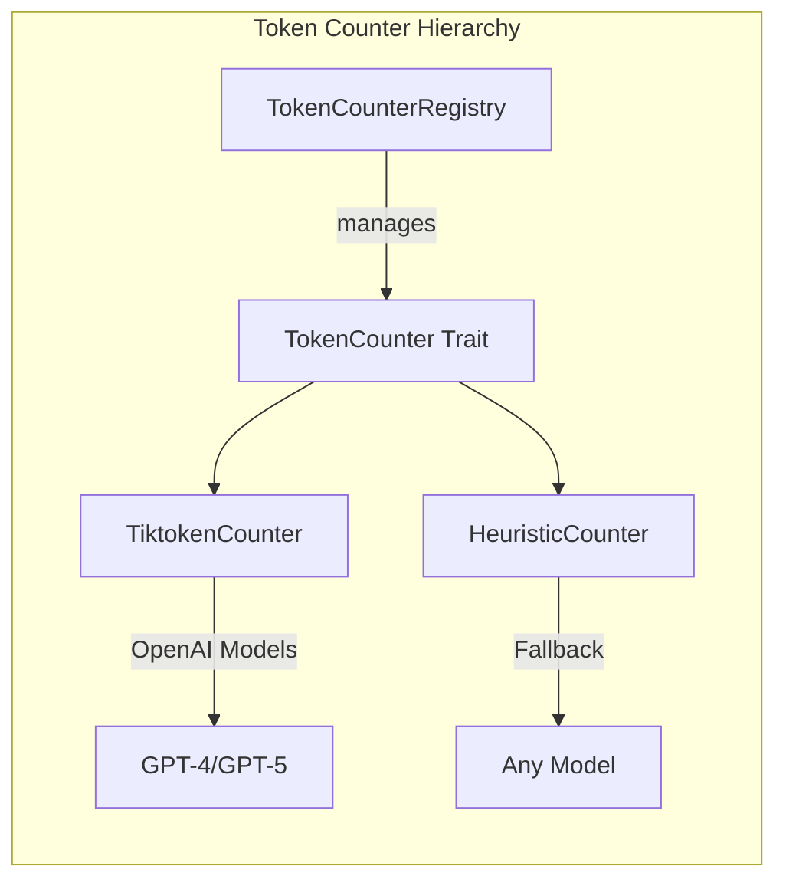
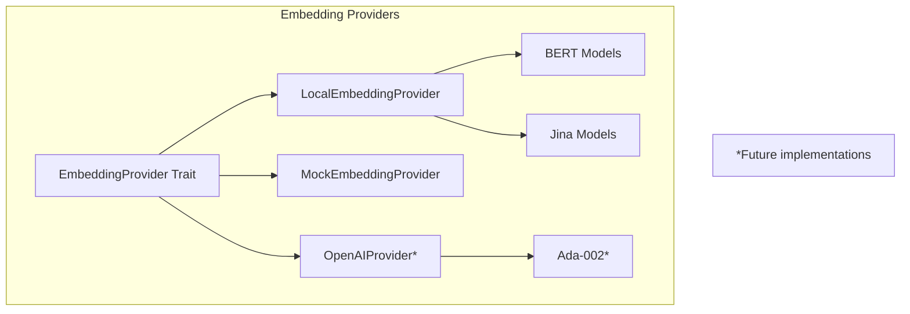
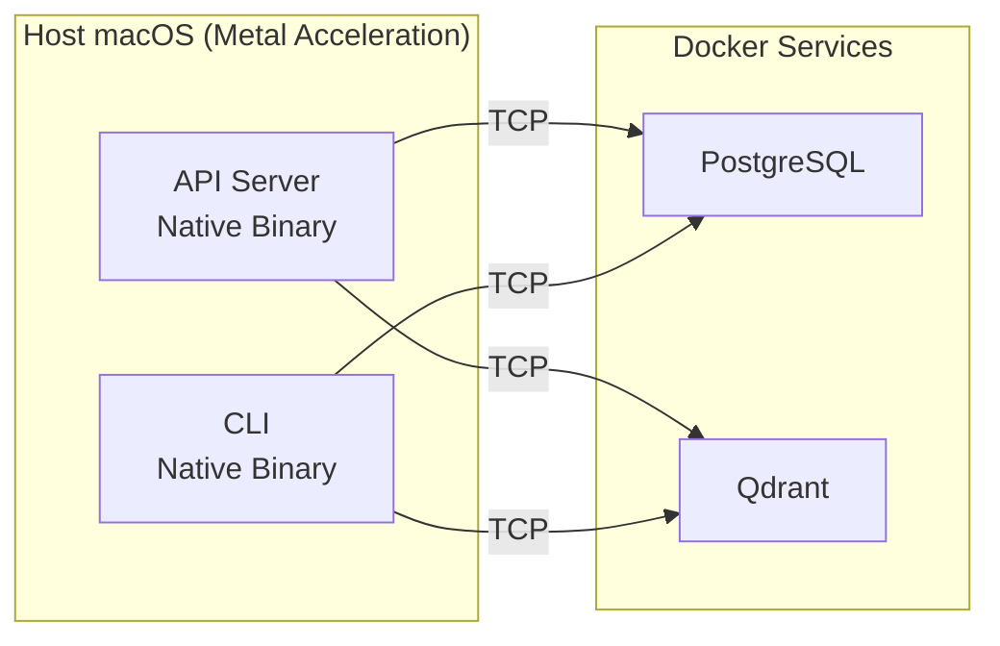
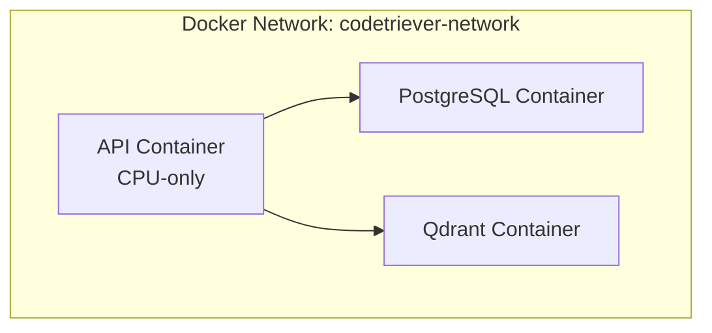
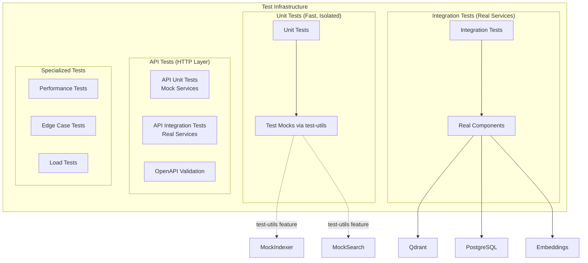

# Codetriever Architecture Documentation

**Last Updated:** October 1, 2025

## System Overview

Codetriever is a code search and retrieval system that indexes codebases using semantic embeddings, enabling intelligent code discovery through vector similarity search. Built in Rust with a modular 10-crate architecture, it provides both REST API and MCP (Model Context Protocol) interfaces for AI agent integration.

## High-Level Architecture



## Modular Crate Structure

Codetriever follows a highly modular architecture with 10 specialized crates:

### Core Service Crates
- **`codetriever-api`**: REST API server with dynamic OpenAPI generation (utoipa), Swagger UI, and HTTP route handlers
- **`codetriever`**: CLI binary and MCP (Model Context Protocol) server for AI agent integration
- **`codetriever-search`**: Search orchestration service coordinating embeddings, vector storage, and metadata retrieval
- **`codetriever-indexing`**: Indexing orchestration service coordinating parsing, embedding, and storage

### Data Layer Crates
- **`codetriever-embeddings`**: ML embedding generation using Candle framework with automatic Metal/CUDA/CPU device selection
- **`codetriever-parsing`**: Tree-sitter based code parsing with token-aware semantic chunking for 25+ languages
- **`codetriever-vector-data`**: Qdrant vector database client for embedding storage and similarity search
- **`codetriever-meta-data`**: PostgreSQL client for file metadata, indexing jobs, and repository tracking

### Foundation Crates
- **`codetriever-config`**: Centralized configuration management with environment variable support
- **`codetriever-common`**: Shared utilities, correlation IDs, and common types

### Design Benefits
- **Clear separation of concerns**: Each crate has a single, well-defined responsibility
- **Testability**: Test-utils features provide mock implementations for unit testing
- **Compile-time optimization**: Only rebuild changed crates during development
- **Dependency clarity**: Explicit crate boundaries prevent circular dependencies

## Component Architecture


## Data Flow

### Indexing Pipeline



### Search Flow



## Storage Architecture

### Dual Storage System



## Key Abstractions

### Token Counting System



### Embedding Provider System



## Hardware Acceleration

### Automatic Device Selection (Metal/CUDA/CPU)

Codetriever uses the Candle ML framework with automatic hardware acceleration detection:

```rust
// Auto-detection logic in codetriever-embeddings
let device = if candle_core::utils::cuda_is_available() {
    Device::new_cuda(0).unwrap_or(Device::Cpu)
} else if candle_core::utils::metal_is_available() {
    Device::new_metal(0).unwrap_or(Device::Cpu)
} else {
    Device::Cpu
};
```

### Device Selection Behavior

1. **CUDA** (NVIDIA GPUs): First priority if available - highest performance for large models
2. **Metal** (Apple Silicon): Second priority on macOS with M1/M2/M3 chips - excellent performance
3. **CPU**: Fallback for all platforms - slower but universally compatible

### Metal Performance (macOS)

- **Native execution**: Runs directly on Apple Silicon without Docker
- **Memory efficiency**: Conservative 512 token limit prevents GPU memory exhaustion
- **Automatic fallback**: Falls back to CPU if Metal initialization fails
- **Docker limitation**: Metal acceleration NOT available in Docker containers (CPU-only)

### Configuration

```yaml
# Environment Variables
DATABASE_URL: PostgreSQL connection string
QDRANT_URL: Qdrant server URL
EMBEDDING_MODEL: Model name (e.g., jinaai/jina-embeddings-v2-base-code)
MAX_EMBEDDING_TOKENS: Maximum tokens per chunk (default: 512)
SPLIT_LARGE_SEMANTIC_UNITS: Whether to split large functions/classes
CHUNK_OVERLAP_TOKENS: Token overlap between chunks
USE_GPU: Whether to use GPU acceleration if available (default: true)
GPU_DEVICE: Specific GPU device (e.g., "cuda:0", "metal", "cpu")
```

## Deployment Architecture

### Native Development (Recommended for macOS)



**Benefits:**
- Full Metal GPU acceleration
- Faster embedding generation
- Direct filesystem access
- Easier debugging

**Usage:**
```bash
# Start only data services in Docker
just docker-up

# Run API natively
cargo run --bin codetriever-api
```

### Fully Containerized (Production/Linux)



**Benefits:**
- Reproducible deployments
- Easy scaling
- Isolated environments
- Cross-platform consistency

**Usage:**
```bash
# Start all services including API
just deploy-prod
```

### Hybrid Approach

Run API/CLI natively for development, containerize for production:
- **Development**: Native binaries + Docker data services (Metal acceleration)
- **CI/CD**: Fully containerized (reproducible tests)
- **Production**: Fully containerized (scalability + isolation)

## Testing Strategy

**Testing Framework Overhaul (September 30, 2025)**

Codetriever uses a comprehensive testing strategy with trait-based mocking and test-utils feature flags.



### Test Organization

**Per-Crate Test Structure:**
- **Unit tests**: `src/` modules with `#[cfg(test)]` using mock implementations
- **Integration tests**: `tests/` directory with real component integration
- **Test utilities**: `test_utils.rs` modules, exported via `test-utils` feature flag

**Test-Utils Feature Flags:**
```toml
# Example from codetriever-indexing
[dev-dependencies]
codetriever-search = { path = "../codetriever-search", features = ["test-utils"] }
```

### Testing Layers

1. **Unit Tests** - Fast, isolated, mock-based
   - `MockIndexerService` for API route testing
   - `MockSearchService` for search logic testing
   - No external dependencies (databases, ML models)
   - Run in milliseconds

2. **Integration Tests** - Slower, comprehensive, real components
   - `qdrant_integration.rs` - Vector storage operations
   - `full_stack_integration.rs` - End-to-end indexing and search
   - `content_indexing_tests.rs` - Real parsing and chunking
   - Require Docker services running

3. **API Tests** - HTTP layer validation
   - `openapi_validation.rs` - OpenAPI spec correctness
   - `performance_regression.rs` - Response time monitoring
   - `edge_case_coverage.rs` - Error handling
   - `load_testing.rs` - Concurrent request handling

4. **Manual Tests** - Developer verification
   - `manual_search_test.rs` - Interactive search testing
   - `byte_offset_test.rs` - Tree-sitter parsing verification

### Running Tests

```bash
# Fast unit tests only (no Docker needed)
cargo test --lib

# All tests including integration (requires Docker)
cargo test

# Specific test suite
cargo test --test qdrant_integration

# With logging
RUST_LOG=debug cargo test -- --nocapture
```

### Mock Implementations

Each service crate provides mock implementations for testing:

| Crate | Mock Implementation | Purpose |
|-------|-------------------|---------|
| `codetriever-indexing` | `MockIndexerService` | Test API routes without real indexing |
| `codetriever-search` | `MockSearchService` | Test API routes without real search |
| `codetriever-vector-data` | `MockVectorStorage` | Test without Qdrant |
| `codetriever-meta-data` | `MockFileRepository` | Test without PostgreSQL |
| `codetriever-embeddings` | `MockEmbeddingProvider` | Test without ML models |

## Design Principles

1. **Dependency Inversion**: All major components depend on trait abstractions
2. **Single Responsibility**: Each service has one clear purpose
3. **Open/Closed**: Easy to add new providers without modifying existing code
4. **Interface Segregation**: Traits are minimal and focused
5. **Testability**: All components can be tested in isolation using mocks

## API Documentation & OpenAPI

**Dynamic OpenAPI Generation (October 2025)**

Codetriever uses `utoipa` for compile-time OpenAPI 3.0 specification generation with integrated Swagger UI.

### Features

- **Type-safe schemas**: Rust structs automatically generate JSON schemas
- **Request/response validation**: OpenAPI spec validates at compile time
- **Interactive documentation**: Swagger UI at `/swagger-ui`
- **API discovery**: OpenAPI JSON at `/api-docs/openapi.json`
- **Automated testing**: `openapi_validation.rs` ensures spec accuracy

### Available Endpoints

**Current (Production-Ready):**
- `POST /api/search` - Semantic code search with similarity scoring
- `POST /api/index` - Index code content (file content in request body, SaaS-ready)

**Planned (See API Design Doc):**
- `POST /api/similar` - Find similar code chunks
- `POST /api/context` - Get surrounding code context
- `POST /api/usages` - Find symbol usages
- `GET /api/status` - System health check
- `GET /api/stats` - Quick statistics
- `DELETE /api/clean` - Remove stale entries
- `POST /api/compact` - Optimize database

### Accessing Documentation

```bash
# Start API server
cargo run --bin codetriever-api

# Open Swagger UI in browser
open http://localhost:8080/swagger-ui

# Fetch OpenAPI spec
curl http://localhost:8080/api-docs/openapi.json
```

## Key Features

### Core Capabilities
- **Language Support**: 25+ programming languages via Tree-sitter
- **Smart Chunking**: Token-aware splitting with overlap for context preservation
- **Multiple Token Counters**: Tiktoken for OpenAI models, heuristic fallback for others
- **Flexible Storage**: Trait-based storage supports Qdrant, mock, and future backends
- **State Tracking**: PostgreSQL tracks file versions and indexing history
- **Incremental Indexing**: Only re-indexes changed files (tracked via file content hashing)
- **Semantic Search**: Vector similarity search using embeddings with correlation ID tracing

### Recent Additions
- **Dynamic OpenAPI**: Compile-time API documentation generation (October 2025)
- **Metal Acceleration**: Automatic GPU detection for Apple Silicon (September 2025)
- **Test Framework**: Comprehensive test-utils with mock implementations (September 2025)
- **Modular Architecture**: 10-crate structure for clear separation of concerns (September 2025)

## Performance Characteristics

### Embedding Performance
- **Batch Size**: 32 texts per batch for optimal GPU utilization
- **Max Tokens**: 512 per chunk (conservative for Metal memory safety)
- **Overlap Tokens**: 128 for context preservation across chunks
- **Vector Dimension**: 768 (Jina v2 base-code) or model-specific

### Hardware Performance
- **Metal (Apple M1/M2/M3)**: ~100-150 embeddings/sec
- **CUDA (NVIDIA GPU)**: ~200-500 embeddings/sec (model-dependent)
- **CPU (Fallback)**: ~10-30 embeddings/sec (varies by processor)

### Storage
- **File Size**: No hard limit - large files automatically chunked by semantic units
- **Index Size**: ~1KB per chunk (metadata) + ~3KB per vector (Qdrant)
- **Database**: PostgreSQL for metadata (~1-2KB per indexed file)

### Scalability
- **Concurrent Indexing**: Thread-safe, parallel file processing via Rayon
- **Search Latency**: <100ms for typical queries (warm cache)
- **Index Time**: ~10-50 files/sec (Metal), ~5-15 files/sec (CPU)

## Implementation Status

### ✅ Production Ready (Tested & Verified)

**Core Pipeline:**
- ✅ Tree-sitter parsing for 25+ languages
- ✅ Token-aware semantic chunking with overlap
- ✅ Candle-based embedding generation with Metal/CUDA/CPU
- ✅ Qdrant vector storage with similarity search
- ✅ PostgreSQL metadata tracking
- ✅ File state tracking and incremental indexing
- ✅ Correlation ID tracing for debugging

**API Layer:**
- ✅ REST API with Axum framework
- ✅ Dynamic OpenAPI generation with utoipa
- ✅ Swagger UI at `/swagger-ui`
- ✅ `/api/search` endpoint (semantic search)
- ✅ `/api/index` endpoint (content indexing)

**Testing:**
- ✅ Comprehensive test suite with mock implementations
- ✅ Integration tests with real services
- ✅ OpenAPI validation tests
- ✅ Performance regression monitoring

### 🚧 Work In Progress

**API Endpoints:**
- 🚧 `/api/similar` - Find similar code (planned)
- 🚧 `/api/context` - Get code context (planned)
- 🚧 `/api/usages` - Symbol usage tracking (planned)
- 🚧 `/api/status` - Health check (planned)

**CLI & MCP:**
- 🚧 MCP server implementation (scaffolded, untested)
- 🚧 CLI commands (exist but may have bugs)

### ⚠️ Known Limitations

**Current Constraints:**
- **Metal in Docker**: Not supported - must run natively for GPU acceleration
- **Incremental Updates**: File state tracking implemented but not extensively tested
- **Multi-tenancy**: Basic project_id support, needs security hardening
- **Error Recovery**: Basic error handling, needs retry logic for transient failures

**Missing Features:**
- No authentication/authorization (planned for SaaS)
- No rate limiting
- No distributed indexing (single-node only)
- No incremental re-indexing on code changes (full re-index required)