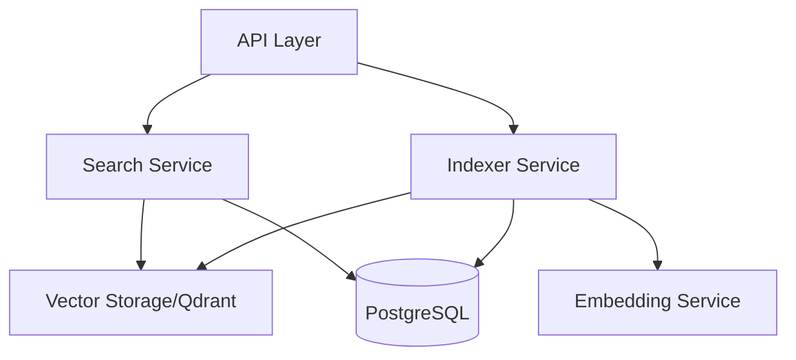

# Architectural Review - Codetriever Search Implementation

**Date:** January 17, 2025
**Reviewer:** Solution Architect
**Focus:** Staged changes for search functionality, API enhancements, and storage patterns

---

## Executive Summary

The staged changes introduce significant architectural improvements to Codetriever's search functionality, transforming it from a simple stub implementation to a comprehensive semantic code search system. The implementation demonstrates strong architectural principles including separation of concerns, trait-based abstraction, and builder patterns. While the foundation is solid, several areas require attention regarding scalability, error handling, and integration complexity.

### Key Architectural Decisions

1. **Trait-Based Abstractions** - Excellent use of trait boundaries for storage, embedding, and search services
2. **Builder Pattern Implementation** - Consistent application across configuration modules
3. **Layered Architecture** - Clear separation between API, business logic, and data layers
4. **Repository Metadata Enhancement** - Rich metadata integration with search results
5. **Async-First Design** - Comprehensive async/await implementation throughout

### Overall Assessment

**Architecture Maturity:** ⭐⭐⭐⭐ (4/5)
The implementation shows mature architectural thinking with room for optimization in error handling and distributed system concerns.

---

## 1. Design Patterns Analysis

### 1.1 Builder Pattern Implementation ✅

**Strengths:**
- Consistent implementation across `PoolConfigBuilder` and `ConfigBuilder`
- Fluent API design with method chaining
- Predefined configurations for common scenarios (development/production)
- Immutable configuration objects

**Code Quality:**
```rust
// Excellent pattern implementation
pub struct PoolConfigBuilder {
    write_pool_size: Option<u32>,
    read_pool_size: Option<u32>,
    analytics_pool_size: Option<u32>,
    // ...
}
```

### 1.2 Repository Pattern 🔍

**Observations:**
- Clear abstraction through `FileRepository` trait
- Separation of read/write concerns with pool segregation
- Good use of Arc for shared ownership

**Recommendation:**
Consider implementing Unit of Work pattern for transactional consistency across multiple repository operations.

### 1.3 Service Layer Pattern ✅

**Implementation:**
- `ApiSearchService` - Simple facade over indexer
- `EnhancedSearchService` - Decorator pattern adding metadata enrichment
- Clean separation of concerns

---

## 2. Architectural Smells & Issues

### 2.1 **[CRITICAL]** Tight Coupling in Search Service

**Issue:** Direct instantiation of `Indexer` within `ApiSearchService`:
```rust
pub fn new() -> Self {
    Self {
        indexer: Arc::new(Mutex::new(Indexer::new())), // Hard dependency
    }
}
```

**Impact:**
- Difficult to test in isolation
- Cannot inject different indexer implementations
- Breaks dependency inversion principle

**Recommendation:**
```rust
pub fn new(indexer: Arc<Mutex<Indexer>>) -> Self {
    Self { indexer }
}
```

### 2.2 **[HIGH]** Missing Circuit Breaker Pattern

**Issue:** No resilience patterns for external service failures (Qdrant, PostgreSQL)

**Impact:**
- Cascading failures when vector storage is unavailable
- Poor user experience during outages
- No graceful degradation

**Recommendation:**
Implement circuit breaker for vector storage operations with fallback to database-only search.

### 2.3 **[MEDIUM]** Synchronous Lock Contention

**Issue:** Use of `Mutex` in async context:
```rust
let mut indexer = self.indexer.lock().await; // Potential bottleneck
```

**Impact:**
- Serial execution of search requests
- Poor concurrency under load

**Recommendation:**
Consider using `RwLock` for read-heavy operations or connection pooling pattern.

### 2.4 **[MEDIUM]** Missing Caching Layer

**Issue:** No caching strategy for search results or embeddings

**Impact:**
- Redundant computation for identical queries
- Higher latency for common searches
- Increased load on vector storage

---

## 3. Modularity & Boundaries Assessment

### 3.1 Module Organization ✅

**Strengths:**
- Clear crate separation: `codetriever-api`, `codetriever-indexer`, `codetriever-data`
- Minimal cross-crate dependencies
- Well-defined public APIs

### 3.2 Trait Boundaries 🔍

**Analysis:**

| Trait | Purpose | Assessment |
|-------|---------|------------|
| `VectorStorage` | Storage abstraction | Well-designed, async-first |
| `SearchProvider` | Search operations | Clean interface |
| `FileRepository` | Data persistence | Good separation |
| `EmbeddingService` | Embedding generation | Flexible abstraction |

**Issue:** Missing trait for token counting abstraction (found in implementation but not exposed)

### 3.3 Dependency Injection

**Current State:**
- Partial DI implementation
- Some services create their own dependencies
- Inconsistent initialization patterns

**Recommendation:**
Implement a dependency injection container or factory pattern for consistent service initialization.

---

## 4. Scalability Considerations

### 4.1 Connection Pool Configuration ✅

**Strengths:**
- Separate pools for read/write/analytics workloads
- Configurable pool sizes
- Environment-specific presets

### 4.2 Horizontal Scalability Concerns ⚠️

**Issues:**
1. **Stateful Indexer**: Single indexer instance with mutex lock
2. **No Distributed Locking**: File processing could duplicate in multi-instance deployment
3. **Missing Partitioning**: No strategy for sharding large repositories

### 4.3 Performance Optimizations

**Implemented:**
- Batch processing for embeddings
- Token counting optimization
- Deterministic chunk IDs (UUID v5)

**Missing:**
- Query result pagination at storage layer
- Streaming response support
- Parallel chunk processing

---

## 5. Integration Architecture

### 5.1 External System Integration



**Assessment:**
- Clean separation of concerns
- Good abstraction boundaries
- Potential for service mesh integration

### 5.2 API Design Improvements

**New Response Structure:**
```json
{
  "matches": [...],
  "metadata": {
    "total_matches": 10,
    "query_time_ms": 45,
    "search_type": "semantic"
  }
}
```

**Strengths:**
- Extensible metadata structure
- Performance metrics included
- Version compatibility considered

---

## 6. Security & Error Handling

### 6.1 Security Considerations ⚠️

**Missing:**
- API authentication/authorization
- Rate limiting
- Input sanitization for search queries
- SQL injection protection (though using parameterized queries)

### 6.2 Error Handling

**Issues:**
- Silent error swallowing: `unwrap_or_else(|_| vec![])`
- No error context propagation
- Missing structured logging

**Recommendation:**
Implement proper error types with context and telemetry integration.

---

## 7. Recommendations by Priority

### Critical (Address Immediately)

1. **Fix Dependency Injection**
   - Refactor `ApiSearchService` to accept injected dependencies
   - Implement service factory or DI container

2. **Add Resilience Patterns**
   - Circuit breaker for external services
   - Retry logic with exponential backoff
   - Timeout configurations

### High Priority (Next Sprint)

1. **Implement Caching Strategy**
   - Query result caching with TTL
   - Embedding cache for common code patterns
   - Consider Redis integration

2. **Improve Concurrency Model**
   - Replace Mutex with RwLock where appropriate
   - Implement connection pooling for indexer
   - Consider actor model for stateful components

3. **Add Observability**
   - OpenTelemetry integration
   - Distributed tracing
   - Metrics collection

### Medium Priority (Technical Debt)

1. **Enhance Error Handling**
   - Structured error types
   - Error context propagation
   - User-friendly error messages

2. **API Versioning**
   - Version in URL path or headers
   - Backward compatibility strategy
   - Deprecation policy

3. **Documentation**
   - API documentation generation
   - Architecture decision records (ADRs)
   - Deployment guides

### Low Priority (Future Enhancements)

1. **Performance Optimizations**
   - Query result streaming
   - Parallel processing pipelines
   - Index optimization strategies

2. **Multi-tenancy Support**
   - Repository isolation
   - Resource quotas
   - Tenant-specific configurations

---

## 8. Architectural Strengths

### What's Working Well

1. **Trait-Based Design** - Excellent abstraction enabling testability and flexibility
2. **Builder Patterns** - Consistent, ergonomic configuration APIs
3. **Async Implementation** - Proper async/await throughout the stack
4. **Test Coverage** - Comprehensive test suite with mocks
5. **Modular Architecture** - Clean crate separation and boundaries

### Innovation Highlights

- **Deterministic Chunk IDs**: Using UUID v5 for content-based addressing
- **Repository Metadata Integration**: Rich context in search results
- **Token-Aware Chunking**: Respects model limitations intelligently

---

## 9. Risk Assessment

| Risk | Likelihood | Impact | Mitigation |
|------|------------|--------|------------|
| Vector storage failure | Medium | High | Implement circuit breaker, fallback search |
| Lock contention under load | High | Medium | Refactor to RwLock, connection pooling |
| Memory exhaustion from large repos | Medium | High | Implement streaming, pagination |
| API breaking changes | Low | Medium | Version from start, deprecation policy |

---

## 10. Conclusion

The Codetriever search implementation demonstrates solid architectural foundations with sophisticated patterns and abstractions. The use of traits for key abstractions provides excellent flexibility and testability. The builder pattern implementations are particularly well-done, providing ergonomic configuration APIs.

However, several critical issues need addressing before production deployment:
1. Dependency injection needs completion
2. Resilience patterns are absent
3. Concurrency model has bottlenecks

The architecture is well-positioned for evolution with clear module boundaries and abstraction layers. With the recommended improvements, particularly around resilience and scalability, this system could handle production workloads effectively.

### Architecture Score Card

| Aspect | Score | Notes |
|--------|-------|-------|
| **Modularity** | 4/5 | Clean separation, minor coupling issues |
| **Scalability** | 3/5 | Good foundation, needs distributed patterns |
| **Maintainability** | 4/5 | Clear code, good abstractions |
| **Testability** | 4/5 | Excellent mocking, needs more DI |
| **Performance** | 3/5 | Optimization opportunities exist |
| **Security** | 2/5 | Basic implementation, needs auth/authz |
| **Resilience** | 2/5 | Missing circuit breakers, retries |

**Overall Architecture Rating: 3.5/5** - Production-ready with recommended improvements

---

## Appendix: Code Examples

### Recommended DI Pattern

```rust
// Service factory pattern
pub struct ServiceFactory {
    config: Arc<Config>,
    db_pool: Arc<DatabasePool>,
    vector_storage: Arc<dyn VectorStorage>,
}

impl ServiceFactory {
    pub fn create_search_service(&self) -> Arc<dyn SearchProvider> {
        Arc::new(EnhancedSearchService::new(
            self.create_indexer(),
            Arc::clone(&self.db_pool),
        ))
    }

    fn create_indexer(&self) -> Arc<Mutex<Indexer>> {
        Arc::new(Mutex::new(Indexer::with_config(
            Arc::clone(&self.config),
            Arc::clone(&self.vector_storage),
        )))
    }
}
```

### Circuit Breaker Example

```rust
use circuit_breaker::{CircuitBreaker, Config};

pub struct ResilientSearchService {
    circuit_breaker: CircuitBreaker,
    primary_service: Arc<dyn SearchProvider>,
    fallback_service: Arc<dyn SearchProvider>,
}

#[async_trait]
impl SearchProvider for ResilientSearchService {
    async fn search(&self, query: &str, limit: usize) -> Result<Vec<SearchResult>> {
        self.circuit_breaker
            .call(async {
                self.primary_service.search(query, limit).await
            })
            .or_else(|_| {
                self.fallback_service.search(query, limit)
            })
            .await
    }
}
```

---

*This architectural review is based on the staged changes and current codebase structure. Regular architecture reviews should be conducted as the system evolves.*