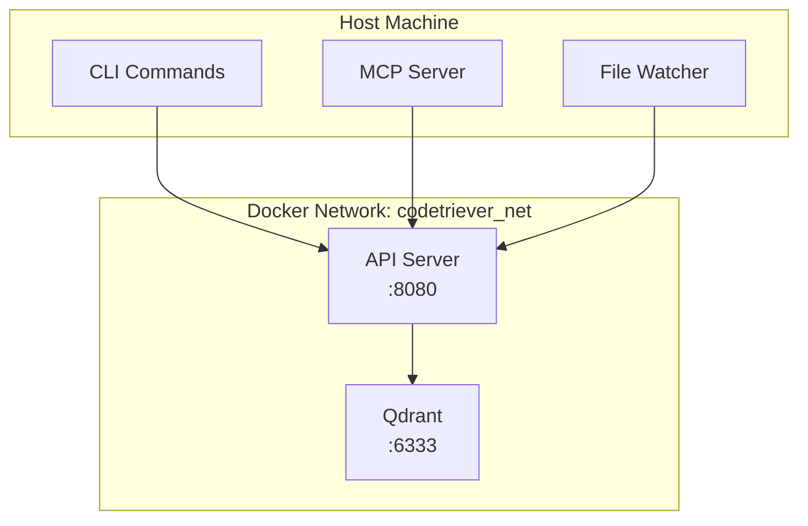

<!-- IMPLEMENTATION STATUS: ✅ IMPLEMENTED with enhancements
- Docker Compose: Fully implemented (dev/data/prod splits)
- Services: Added PostgreSQL (not in original plan)
- Volumes: Working in ~/.codetriever/
- Health checks: Implemented for all services
- Network isolation: Working as planned
- Evolution: More sophisticated than original plan (3 compose files vs 1)
-->

# Codetriever Docker Architecture

**Production-ready containerization from day one**

## Service Architecture



## Service Definitions

### API Server (`codetriever-api`)

**Purpose**: Heavy compute operations and business logic

**Responsibilities**:
- Tree-sitter code parsing
- Vector embedding generation
- Search query processing
- Index management
- Stats and monitoring

**Dockerfile**:
```dockerfile
# Multi-stage build for small image
FROM rust:1.75 as builder

WORKDIR /app
COPY Cargo.toml Cargo.lock ./
COPY src ./src

RUN cargo build --release

FROM debian:bookworm-slim

RUN apt-get update && \
    apt-get install -y ca-certificates && \
    rm -rf /var/lib/apt/lists/*

COPY --from=builder /app/target/release/codetriever-api /usr/local/bin/

EXPOSE 8080
CMD ["codetriever-api"]
```

### Qdrant Service

**Purpose**: Vector storage and similarity search

**Configuration**:
```yaml
qdrant:
  image: qdrant/qdrant:latest
  ports:
    - "6333:6333"     # gRPC port
    - "6334:6334"     # HTTP port (optional)
  volumes:
    - qdrant_storage:/qdrant/storage
  environment:
    - QDRANT__SERVICE__HTTP_PORT=6334
    - QDRANT__SERVICE__GRPC_PORT=6333
    - QDRANT__LOG_LEVEL=INFO
  restart: unless-stopped
```

## Docker Compose Configuration

### Full Stack (`docker-compose.yml`)

```yaml
version: '3.8'

services:
  api:
    image: codetriever/api:${VERSION:-latest}
    container_name: codetriever-api
    ports:
      - "8080:8080"
    environment:
      - RUST_LOG=${LOG_LEVEL:-info}
      - QDRANT_URL=http://qdrant:6334
      - EMBEDDING_MODEL=${EMBEDDING_MODEL:-local}
      - MAX_CHUNK_SIZE=${MAX_CHUNK_SIZE:-200}
    depends_on:
      qdrant:
        condition: service_healthy
    healthcheck:
      test: ["CMD", "curl", "-f", "http://localhost:8080/health"]
      interval: 10s
      timeout: 3s
      retries: 3
    restart: unless-stopped
    networks:
      - codetriever_net
    
  qdrant:
    image: qdrant/qdrant:${QDRANT_VERSION:-latest}
    container_name: codetriever-qdrant
    ports:
      - "6333:6333"
      - "6334:6334"
    volumes:
      - type: volume
        source: qdrant_storage
        target: /qdrant/storage
    environment:
      - QDRANT__LOG_LEVEL=${QDRANT_LOG_LEVEL:-INFO}
    healthcheck:
      test: ["CMD", "curl", "-f", "http://localhost:6334/health"]
      interval: 10s
      timeout: 3s
      retries: 3
    restart: unless-stopped
    networks:
      - codetriever_net

volumes:
  qdrant_storage:
    name: codetriever_qdrant_data
    driver: local
    driver_opts:
      type: none
      o: bind
      device: ${QDRANT_DATA_PATH:-~/.codetriever/data/qdrant}

networks:
  codetriever_net:
    name: codetriever_network
    driver: bridge
    ipam:
      config:
        - subnet: 172.20.0.0/16
```

### Development Override (`docker-compose.dev.yml`)

```yaml
version: '3.8'

services:
  api:
    build:
      context: ../codetriever-api
      dockerfile: Dockerfile.dev
    volumes:
      - ../codetriever-api/src:/app/src
      - cargo_cache:/usr/local/cargo/registry
    environment:
      - RUST_LOG=debug
      - RUST_BACKTRACE=1
    command: cargo watch -x run

volumes:
  cargo_cache:
    name: codetriever_cargo_cache
```

## Volume Management

### Persistent Data

```
~/.codetriever/data/
├── qdrant/
│   ├── collections/     # Vector collections
│   ├── snapshots/       # Backups
│   └── wal/            # Write-ahead log
├── cache/
│   ├── embeddings/     # Cached embeddings
│   └── parse_trees/    # Cached ASTs
└── indexes/
    └── metadata.db     # File metadata
```

### Backup Strategy

```bash
#!/bin/bash
# backup.sh - Backup Codetriever data

BACKUP_DIR="$HOME/backups/codetriever/$(date +%Y%m%d)"
mkdir -p "$BACKUP_DIR"

# Stop services for consistent backup
docker-compose stop

# Backup Qdrant data
docker run --rm \
  -v codetriever_qdrant_data:/data \
  -v "$BACKUP_DIR":/backup \
  alpine tar czf /backup/qdrant.tar.gz -C /data .

# Backup configuration
cp -r ~/.codetriever/config.toml "$BACKUP_DIR/"

# Restart services
docker-compose start

echo "Backup complete: $BACKUP_DIR"
```

### Migration Support

```rust
// In API server startup
async fn migrate_database() -> Result<()> {
    let current_version = get_schema_version().await?;
    let target_version = SCHEMA_VERSION;
    
    if current_version < target_version {
        info!("Migrating from v{} to v{}", current_version, target_version);
        run_migrations(current_version, target_version).await?;
    }
    
    Ok(())
}
```

## Network Configuration

### Internal Communication

Services communicate over the internal Docker network:
- API → Qdrant: `http://qdrant:6334`
- No exposed ports except what's needed

### Security Considerations

```yaml
# Production overrides
services:
  api:
    expose:
      - "8080"  # Only to reverse proxy
    networks:
      - codetriever_net
      - proxy_net  # External proxy network
    
  qdrant:
    ports: []  # No external access
    expose:
      - "6334"  # Only to API
```

## Service Health Monitoring

### Health Endpoints

**API Server** (`/health`):
```json
{
  "status": "healthy",
  "version": "0.1.0",
  "services": {
    "qdrant": "connected",
    "indexer": "idle"
  },
  "stats": {
    "indexed_files": 15234,
    "total_chunks": 89421,
    "index_size_mb": 124
  }
}
```

### Docker Healthchecks

Built into each service for automatic restart on failure.

### Monitoring Commands

```bash
# Check service status
codetriever status

# Output:
# ✓ API Server: healthy (http://localhost:8080)
# ✓ Qdrant: healthy (6334)
# ✓ File Watcher: active (15,234 files)
# ✓ Last index: 2 minutes ago

# View logs
codetriever logs --tail 50 --follow

# Service metrics
codetriever stats
```

## Resource Management

### Memory Limits

```yaml
services:
  api:
    deploy:
      resources:
        limits:
          memory: 2G
        reservations:
          memory: 512M
          
  qdrant:
    deploy:
      resources:
        limits:
          memory: 4G
        reservations:
          memory: 1G
```

### CPU Allocation

```yaml
services:
  api:
    deploy:
      resources:
        limits:
          cpus: '2.0'
        reservations:
          cpus: '0.5'
```

## Development Workflow

### Local Development

```bash
# Start services in dev mode
docker-compose -f docker-compose.yml -f docker-compose.dev.yml up

# Hot reload enabled for API
# Qdrant uses production image

# Run tests against services
cargo test --features integration

# Clean restart
docker-compose down -v && docker-compose up
```

### Debugging

```bash
# Attach to running container
docker exec -it codetriever-api bash

# View detailed logs
docker logs -f codetriever-api

# Inspect network
docker network inspect codetriever_network
```

## Production Deployment

### Docker Swarm

```yaml
# docker-stack.yml
version: '3.8'

services:
  api:
    image: codetriever/api:latest
    deploy:
      replicas: 2
      update_config:
        parallelism: 1
        delay: 10s
      restart_policy:
        condition: on-failure
```

### Kubernetes

```yaml
# k8s/deployment.yaml
apiVersion: apps/v1
kind: Deployment
metadata:
  name: codetriever-api
spec:
  replicas: 3
  selector:
    matchLabels:
      app: codetriever-api
  template:
    metadata:
      labels:
        app: codetriever-api
    spec:
      containers:
      - name: api
        image: codetriever/api:latest
        ports:
        - containerPort: 8080
        env:
        - name: QDRANT_URL
          value: "http://qdrant-service:6334"
```

## Scaling Strategy

### Horizontal Scaling

- API servers: Stateless, scale freely
- Qdrant: Single instance for local, cluster for production
- File watcher: One per repository root

### Vertical Scaling

- Increase memory for larger codebases
- More CPU cores for faster indexing
- SSD storage for Qdrant performance

## Why Docker?

1. **Consistency**: Same environment everywhere
2. **Isolation**: No dependency conflicts
3. **Portability**: Runs on any Docker host
4. **Scalability**: Ready for cloud deployment
5. **Simplicity**: One command to start everything